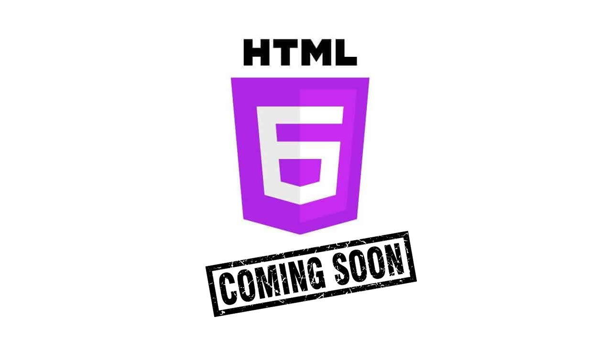

There is nothing more depressing for a XXI century user than to open a webpage that is still based on the 2000(XX century) layout concept on devices such as the latest Huawei Pro, Apple Iphone, Samsung Galaxy and so on, it feels like playing a 360p video on an 8k screen, if we want to see the future of webdesign full of wonders, it is up to us to first build a solid foundation for it to happen!

This is not about what you and I are going to get if we do this, is about what they are not going to get if we dont do it.

The continuous creation of the web layout wonders by the future generation lies on the choices that **WE** the current generation make, because for some of them might not be a tomorrow(congruency of the webdesign with their time), comes tomorrow they still trying to solve the problems of the past(that we've ignored) so that they can live the present of their tomorrow!

There are so many Front-End frameworks out there and almost all of them are based in one Philosophy → simplify and speed the web development, after I've built the [Davuca Framework](https://davucacss.com/) I came to realise that we will not stop building frameworks until one major problem is fixed → **HTML5**, and it feels like if I ignore this problem I will be robbing the future generation the true meaning of a Web Designer.

In our days there are more than 100 front-end frameworks, which means that those whom come after us would have to master at least 10 of them to be complient with the demands of the current market, and to that I say no, if a framework has to be built I say we build it together from the roots of webdesign, bringing each and every individuals ideas into one main frame, without taking away from them the freedom of creativity!

Those whom have created the **HTML** syntax have done a great job, those whom updated it to **version 5** did the best they could, but now it's up to us to make the last stand!

For us whom have pushed webdesign to the limit using the static languages - **HTML & CSS**, by creating incredible UI & UX interactions from [Pure CSS3 3D Oriented Cities](https://codepen.io/rhiros/pen/bBnwE) to [Interactive Life Experience Designs](https://codepen.io/r4ms3s/pen/XJqeKB), let us share that little enlightment with those whom are to come after us, sometimes for an human being to unleash its greatness and go beyond expectation it must first be inspired by somthing greater than its current reality and imagination!

Shall we beggin!?

## Tags
- [x] @mentions, #refs, [links](), **formatting**, and <del>tags</del> supported
`<addr>` element here instead.
